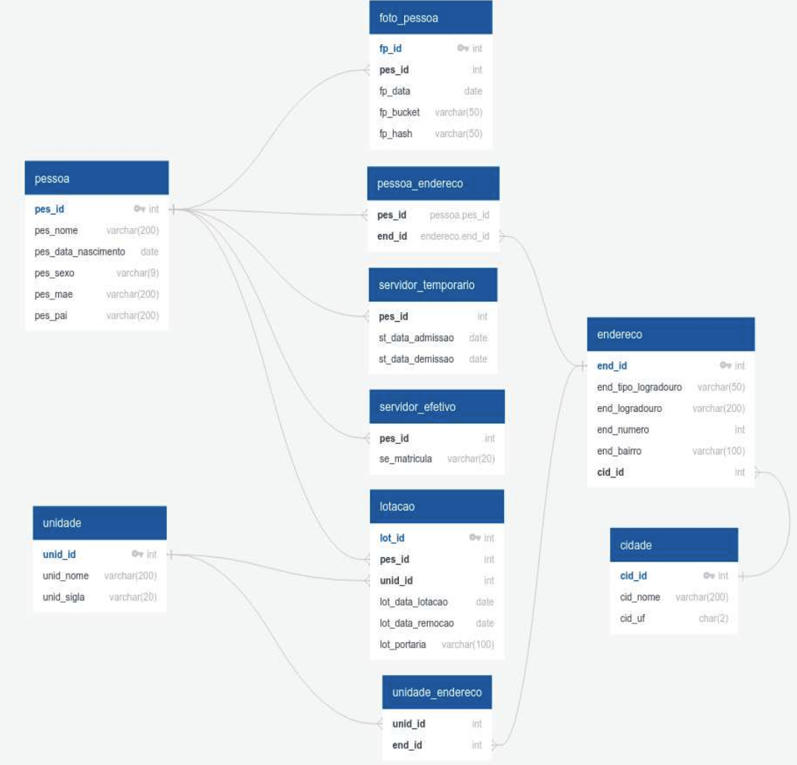

Vamos revisar e ajustar o checklist:

Segue um checklist sequencial e direto para o projeto em PHP:

1. **Preparação do Ambiente**  
   - [ ] Configurar o Docker Compose com:
     - Container PostgreSQL (última versão);
     - Container Min.IO para armazenamento S3.
   - [ ] Criar o repositório no GitHub com README.md contendo seus dados e instruções de execução.

2. **Autenticação & Autorização**  
   - [ ] Implementar mecanismo de autenticação e autorização.
   - [ ] Definir expiração de 5 minutos para a sessão com opção de renovação.
   - [ ] Restringir o acesso aos endpoints para o domínio onde o serviço está hospedado.

3. **Implementação da API REST**  
   - [ ] Definir rotas utilizando os verbos: **POST**, **PUT**, **GET**.
   - [ ] Adicionar recursos de paginação em todas as consultas.
   - [ ] Garantir que os dados sejam salvos no PostgreSQL.

4. **CRUDs e Endpoints Específicos**  
   - [ ] Criar CRUD para:
     - Servidor Efetivo;
     - Servidor Temporário;
     - Unidade;
     - Lotação.
   - [ ] Incluir e editar dados das tabelas relacionadas.
   - [ ] Endpoint para consulta de servidores efetivos:
     - Parametrizado por `unid_id`.
     - Retornar: Nome, idade, unidade de lotação e fotografia.
   - [ ] Endpoint para consulta do endereço funcional:
     - Baseado em parte do nome do servidor efetivo.
  
5. **Upload e Recuperação de Imagens**  
   - [ ] Realizar upload de uma ou mais fotografias para o Min.IO.
   - [ ] Recuperar as imagens através de links temporários com expiração de 5 minutos.

6. **Finalização**  
   - [ ] Adicionar todas as dependências necessárias.
   - [ ] Comitar todos os arquivos e scripts utilizados.
   - [ ] Não realizar commits após o prazo de entrega.

Esse fluxo deve te ajudar a manter a lógica e a sequência na criação do projeto em PHP. Qualquer dúvida, só chamar!